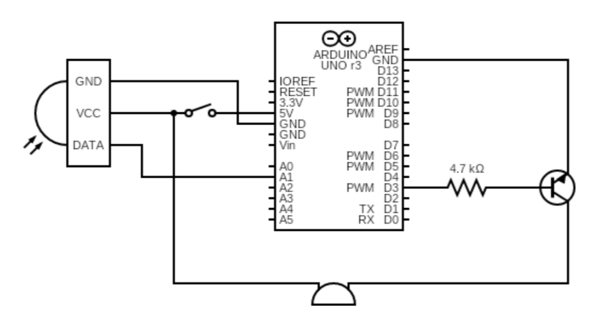

# Project Title - ANTI-SLEEP GLASSES

## Introduction
Developed "ANTI-SLEEP GLASSES," an innovative wearable technology designed to enhance driver safety by preventing drowsiness. The glasses are equipped with an IR sensor that detects the movement of eyelashes. If the eyelashes remain closed for more than 5 seconds, indicating drowsiness, the glasses vibrate to alert the driver, ensuring they remain awake and attentive on the road.

## Components Used
| Components Name | Components Details | Product Link |
--- | --- | --- |
| Arduino Uno R3 | Acts as the main control board. | [X1 Link](https://amzn.eu/d/6wBItzO) |
| IR Sensor | Detects eye closure by measuring reflected IR radiation. | [X1 Link](https://amzn.eu/d/7M8i4vN) |
| Transistor BC547 NPN | Used to amplify the signal for the buzzer. | [X1 link](https://amzn.eu/d/gvKECr3) |
| 5 Volt Active Buzzer | Emits sound alerts when drowsiness is detected. | [X1 link](https://amzn.eu/d/4ODkuQO) |
| Resistors 4.7K ohm | Used in the circuit for proper current flow. | [X1 link](https://amzn.eu/d/3AlVW8P) |
| Glasses Frame | Houses the electronic components. | [X1 link](https://amzn.eu/d/hrYkqn6) |
| 3.7v Battery | Power the entire setup. | [X1 link](https://amzn.eu/d/07cBB3J) |

The list for entire components are [listed here](https://www.amazon.in/hz/wishlist/ls/QFEMFMPNNZPH?ref_=wl_share).

## How it Works
The working of this project is based on an Infra Red Sensor, This sensor is the heart of this project.

Let's take a look to the IR Sensor. Basically it has a transmitter IR LED, A photo Diode, an Opp-amplifier IC and a potentiometer.
The photo diode is placed just next to the IR LED in such a way that it can not receive IR rays directly. Photodiode is sensitive to the IR radiation. It's cathode connected to the positive voltage i.e. 5volt and anode connected to the non-inverting input of the Opp-amplifier which also get pulled down though the 10Kilo ohm resistor. Potentiometer in IR sensor is use to set the sensitivity distance of the sensor, it connected to the inverting input of the Opp-amplifier. IR LED continuously transmit the infra red rays and if any object comes in front of it, IR rays get reflected back and it received by the photo diode due to this change in IR radiation the voltage at the anode get change, the change in anode voltage is depend on the IR radiation received by the photo diode. More the IR radiation received grater will be the change in anode voltage. The output of the IR Sensor taken from the output of the Opp-amplifier. We can adjust the sensitivity distance by rotating the potentiometer on the sensor, we rotate the potentiometer that means we set a threshold voltage for the noninverting input of the Opp-amplifier. Whenever the voltage on the noninverting input is greater than the threshold voltage, the voltage on the noninverting input i.e. +ve voltage from the photodiode get forwarded and get the positive pulse at the output of the Opp-amplifier i.e. output of the sensor.

Let's see the main circuit diagram of the project. I connected a IR sensor to the Arduino Uno R3 board as Vcc of the sensor to the vcc of the Arduino Uno, Ground to the ground and the output of the sensor to the Analog pin one (A1) of the Arduino Uno. I used a 5 volt buzzer for alerting. I connected buzzer to general purpose NPN Transistor (BC547) to drive it. Transistor's emitter connected to the ground and collector connected to the negative pin of the buzzer. Positive terminal of buzzer is further connected to the vcc of the Arduino Uno. Base of the transistor connected to the pin D3 of the Arduino Uno through the 4.7 kilo ohm resistor.

## Circuit Setup
### Connect the IR sensor to Arduino:
 - Vcc to Arduino's Vcc
 - Ground to Arduino's Ground
 - Output to Analog pin A1

### Connect a buzzer using a transistor:
 - Buzzer's negative pin to transistor collector
 - Transistor emitter to Ground
 - Transistor base connected to Arduino pin D3 via a resistor

### Sensor setting:
 - set the sensitivity distance to minimum 10mm or less

## Circuit Diagram


## Programming
After wiring connect Arduino Uno with computer using USB cable. Copy the following Arduino code and pest it in Arduino ide. Now goto tool menu and select board Arduino Pro mini, Again goto tool menu and select COM port. And Now click on upload Button. after uploading the program all done and its ready to play.
```
// The Arduino code monitors the sensor input and controls the buzzer output. When prolonged eye closure is detected, it triggers an alert.
int Sinput = A1;    // creating or assigning an int type variable for sensor input signal
int Buz=3;            // creating or assigning an int type variable for output buzz and vibrator


void setup()      /// in void setup we make the selected pins output or input.
{
pinMode(Sinput, INPUT);  /// here it is sensors pin  so we are defining here that this pin is input pin
pinMode(Buz, OUTPUT); /// here it is the pin used for transistor to control it,   so we are defining here that this pin is output pin
}


void loop()
{
  
if(digitalRead(Sinput)==LOW)
{
delay (1000);    // we are waiting for two second after the input pulse from the sensor. if the pulse is for more than  1 second then buzzer get triggered

digitalWrite(Buz, HIGH);
}

else
{
if(digitalRead(Sinput)== HIGH)
{
digitalWrite(Buz, LOW);
}
}

}
```


## POSTER


## License
This project is licensed under the MIT License - see the [LICENSE](LICENSE) file for details.

## Contact Information

If you have any questions or feedback, please feel free to contact us:

- **Email:** [Send mail](mailto:ankitprajapati26032002@gmail.com)
- **GitHub Issues:** [Create an issue](https://github.com/MR-ANKEY/ANTI-SLEEP-GLASSES/issues)
